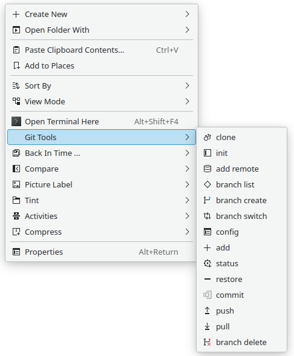

# Git Tools Servicemenu

Top git commands needed to manage a local git repository.

Right click in a dolphin project folder to access the servicemenu:

1. Clone an existing repository to add it to the project folder
2. Initialize a git repository in the project folder
3. Add a remote repository to the local git repository
4. List the local branches of the git repository
5. Create a new branch in the local git repository
6. Switch to a different branch of the local git repository
7. Check the configuration of the local git repository
8. Add file(s) to the staging area for the local git repository
9. Verify the status of the staging area and files in the local git repository
10. Remove a file from the staging area and return it to the project folder
11. Commit staging area file(s) with a message for the remote repository
12. Push commit to the remote repository branch specified
13. Pull branch from the remote repository for the latest commits
14. Switch to another branch of the repository
15. Delete a branch of the local git repository

## Requires

git

konsole

kdialog

License

GPL-3.0